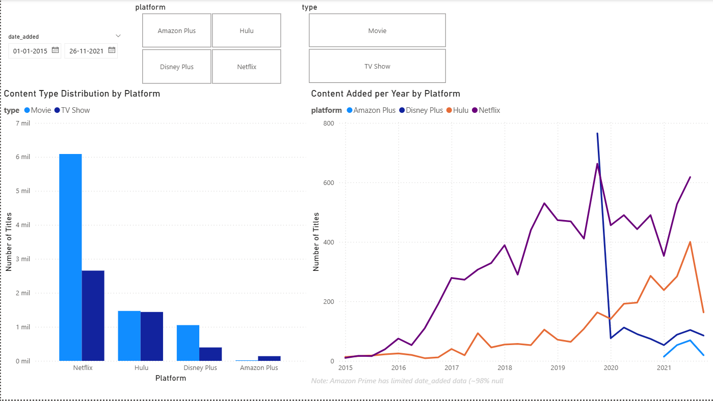

# Streaming Platforms Content Analysis

## Problem Statement

With the rapid growth of streaming platforms, each service (Netflix, Amazon Prime, Disney+, and Hulu) has built a unique content catalog to attract and retain subscribers. Understanding how these catalogs differ in terms of content type (Movies vs TV Shows), genre distribution, and temporal growth patterns is valuable for industry analysts, content strategists, and consumers alike.

This project builds an end-to-end batch data pipeline that ingests, transforms, and visualizes catalog data from four major streaming platforms to answer:

- **Which platform has the largest catalog, and what is the Movie vs TV Show split?**
- **How has content production evolved over the years across platforms?**
- **What genres and ratings dominate each platform?**

## Architecture

```
┌─────────────┐     ┌──────────────────┐     ┌──────────────────┐     ┌────────────┐
│   Kaggle    │     │  Google Cloud     │     │    BigQuery       │     │  Power BI  │
│  Datasets   │────>│  Storage (Lake)   │────>│  (Warehouse)      │────>│ Dashboard  │
│  (4 CSVs)   │     │  movies-tv-show   │     │  movies_tv_shows  │     │            │
└─────────────┘     └──────────────────┘     └──────────────────┘     └────────────┘
   Python              Python                   Bruin Pipeline
  (get_data.py)       (get_data.py)         (ingestr + SQL transform)

Infrastructure provisioned with Terraform
```

### Pipeline Steps

1. **Data Extraction**: Python script downloads datasets from Kaggle using `kagglehub`
2. **Data Lake Upload**: Same script uploads CSVs to a Google Cloud Storage bucket
3. **Data Ingestion**: Bruin `ingestr` assets load data from GCS into BigQuery raw tables
4. **Data Transformation**: Bruin SQL asset unions the 4 raw tables, cleans nulls, removes duplicates, and creates a partitioned + clustered final table
5. **Visualization**: Power BI dashboard connected to BigQuery

## Tech Stack

| Component | Technology |
|---|---|
| Cloud | Google Cloud Platform (GCP) |
| Infrastructure as Code | Terraform |
| Data Lake | Google Cloud Storage |
| Data Warehouse | BigQuery |
| Workflow Orchestration | Bruin |
| Transformations | Bruin (SQL assets) |
| Dashboard | Power BI |
| Language | Python, SQL |

## Datasets

Four datasets from Kaggle, all by [Shivam Bansal](https://www.kaggle.com/shivamb):

| Platform | Dataset | Records |
|---|---|---|
| Netflix | [netflix-shows](https://www.kaggle.com/datasets/shivamb/netflix-shows) | ~8,800 |
| Amazon Prime | [amazon-prime-movies-and-tv-shows](https://www.kaggle.com/datasets/shivamb/amazon-prime-movies-and-tv-shows) | ~9,600 |
| Hulu | [hulu-movies-and-tv-shows](https://www.kaggle.com/datasets/shivamb/hulu-movies-and-tv-shows) | ~3,000 |
| Disney+ | [disney-movies-and-tv-shows](https://www.kaggle.com/datasets/shivamb/disney-movies-and-tv-shows) | ~1,450 |

## Data Warehouse Optimization

The final `all_titles` table is optimized with:

- **Partitioning** by `release_year` using `RANGE_BUCKET(release_year, GENERATE_ARRAY(1900, 2030, 10))` — groups data by decade, so temporal queries only scan relevant partitions
- **Clustering** by `platform` and `type` — queries that filter or group by platform or content type (Movie/TV Show) are significantly faster since BigQuery reads only the relevant data blocks

## Transformations

The Bruin SQL transformation asset (`assets/all_titles.sql`) performs:

- **UNION ALL** of the 4 raw tables into a single unified table
- **Null handling** with `COALESCE()` for `director`, `cast`, `country`, and `rating`
- **Column normalization** — Hulu lacks a `cast` column, so it is added as `NULL`
- **Deduplication** using `ROW_NUMBER()` partitioned by `title` and `platform`
- **Platform tagging** — adds a `platform` column to identify the source

## Dashboard

Built with Power BI, the dashboard includes:

- **Content Type Distribution by Platform** — bar chart comparing Movies vs TV Shows across platforms
- **Content Added per Year by Platform** — line chart showing temporal growth of each platform's catalog

> Note: Amazon Prime has limited `date_added` data (~98% null)



## How to Reproduce

### Prerequisites

- Python 3.13+
- [uv](https://docs.astral.sh/uv/) (Python package manager)
- [Terraform](https://developer.hashicorp.com/terraform/downloads)
- [Google Cloud CLI](https://cloud.google.com/sdk/docs/install) (`gcloud`)
- [Bruin CLI](https://github.com/bruin-data/bruin)
- [Kaggle account](https://www.kaggle.com/) (for dataset downloads)
- GCP account with billing enabled
- Power BI Desktop (for dashboard)

### Step 1: Clone the repository

```bash
git clone <repository-url>
cd "Movies and TV Shows"
```

### Step 2: Set up Python environment

```bash
uv sync
```

### Step 3: Authenticate with Google Cloud

```bash
gcloud auth login
gcloud auth application-default login --no-launch-browser
```

### Step 4: Provision infrastructure with Terraform

```bash
cd terraform

# Create terraform.tfvars with your billing account:
# billing_account = "YOUR-BILLING-ACCOUNT-ID"

terraform init
terraform plan
terraform apply
```

This creates:
- A GCP project
- A Cloud Storage bucket (Data Lake)
- A BigQuery dataset (Data Warehouse)
- Enables required APIs (Storage, BigQuery)

### Step 5: Configure Bruin

Edit `.bruin.yml` in the project root with your credentials:

```yaml
default_environment: default
environments:
    default:
        connections:
            google_cloud_platform:
                - name: "gcp-default"
                  project_id: "YOUR-PROJECT-ID"
                  service_account_file: "/path/to/application_default_credentials.json"
                  location: "us-central1"
            gcs:
                - name: "gcs"
                  service_account_file: "/path/to/application_default_credentials.json"
```

### Step 6: Download datasets and upload to GCS

```bash
uv run python get_data.py
```

### Step 7: Run the Bruin pipeline

```bash
bruin run .
```

This will:
1. Ingest CSVs from GCS into BigQuery raw tables
2. Transform and merge them into the `all_titles` final table

### Step 8: Connect Power BI to BigQuery

1. Open Power BI Desktop
2. Get Data > Google BigQuery
3. Connect with your Google account
4. Select the `movies_tv_shows.all_titles` table
5. Build your visualizations

## Project Structure

```
.
├── assets/                        # Bruin pipeline assets
│   ├── raw_hulu.asset.yml         # Ingest Hulu data from GCS to BQ
│   ├── raw_netflix.asset.yml      # Ingest Netflix data from GCS to BQ
│   ├── raw_amazon_prime.asset.yml # Ingest Amazon data from GCS to BQ
│   ├── raw_disney_plus.asset.yml  # Ingest Disney+ data from GCS to BQ
│   └── all_titles.sql             # SQL transformation: union + clean + deduplicate
├── terraform/                     # Infrastructure as Code
│   ├── main.tf                    # GCP resources definition
│   └── variables.tf               # Terraform variables
├── .bruin.yml                     # Bruin connection config (gitignored)
├── pipeline.yml                   # Bruin pipeline definition
├── get_data.py                    # Download datasets + upload to GCS
├── get_data.ipynb                 # Exploratory data analysis notebook
├── dashboard.png                  # Dashboard screenshot
├── pyproject.toml                 # Python project config
└── README.md
```
